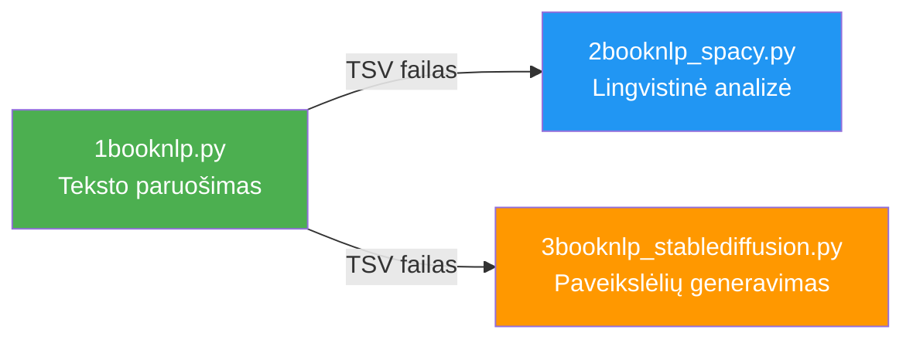

# 📖 1booknlp.py — Knygos teksto paruošimas NLP analizei

**Failas:** [1booknlp.py](file:///c:/Users/jarek/Desktop/uzduotys/uzd3/1booknlp.py)  
**Originalus Colab:** [BookNLP.ipynb](https://colab.research.google.com/drive/1JTWPWybrq_TAUfHckIB0dTpeaC1cv_8K)  
**Eilučių skaičius:** 538 | **Dydis:** ~20 KB

---

## 🎯 Bendras tikslas (paprastai)

Šis failas yra **pirmasis žingsnis** iš trijų sąsiuvinių (notebook) „vamzdyno" (pipeline). Jo užduotis – pasiimti knygos tekstą iš interneto (pvz., iš Project Gutenberg), suskaidyti jį į **pastraipas** ir **skyrius**, pažymėti, kur yra **dialogai** (veikėjų kalbėjimas), ir išsaugoti sutvarkytus duomenis kaip lentelę, kurią vėliau naudos kiti du sąsiuviniai.

**Analogija:** Įsivaizduokite, kad turite popierinę knygą ir norite ją paruošti kompiuterinei analizei. Šis failas tą knygą „nuskenuoja", suskaldo puslapiais, pažymi, kur kas kalba, ir viską sudeda į tvarkingą Excel-panašią lentelę.

---

## 📋 Kas gaunama rezultate?

| Rezultatas | Aprašymas |
|---|---|
| `df_paragraphs` | Lentelė, kurioje kiekviena eilutė = viena pastraipa. Stulpeliai: teksto turinys, skyriaus numeris, ar tai dialogas. |
| `df_chapters_info` | Lentelė su skyrių pavadinimais ir žodžių skaičiais kiekviename skyriuje. |
| TSV failas Google Drive | Eksportuota `df_paragraphs` lentelė `.tsv` formatu (kaip Excel, tik su Tab ženklais). |

---

## 🔍 Detalus kodo aprašymas dalimis

---

### 1. Tomo pasirinkimas (50 eil.)

```python
Vol = 'Vol2'
```

**Techniškai:** Nustato kintamąjį `Vol`, kuris naudojamas konstruoti aplankų kelią Google Drive.

**Paprastai:** Pasirenkame „lentyną", į kurią dėsime savo knygos duomenis. `Vol2` reiškia antrąją lentyną. Jei turėtume kelias knygas, galėtume jas grupuoti į skirtingas lentynas.

---

### 2. Aplinkos paruošimas ir metaduomenų sinchronizacija (58–89 eil.)

```python
from google.colab import files, drive
import pandas as pd
import urllib.request
import os.path
import re
import requests
import json

# Google Drive prijungimas
if os.path.isdir('/content/drive/MyDrive'):
    print('Google Drive is mounted.')
else:
    drive.mount('/content/drive')

# Knygų žodyno atsisiuntimas iš GitHub
response = requests.get("https://raw.githubusercontent.com/.../file_path_dic.json")
file_path_dic = json.loads(response.text)
```

**Techniškai:**
- Importuojamos reikalingos bibliotekos: `pandas` (duomenų lentelės), `re` (reguliariosios išraiškos), `requests` (HTTP užklausos), `json` (JSON formatavimas).
- Prijungiamas Google Drive, kad galėtume skaityti/rašyti failus.
- Atsisiunčiamas `file_path_dic.json` – tai žodynas (dictionary), kuriame saugomi visų anksčiau apdorotų knygų parametrai (pavadinimas, kodas, skyriaus atpažinimo šablonas ir kt.).
- Jei Google Drive jau turi lokalų šio žodyno variantą, jis sujungiamas su GitHub versija (kad neprarastume savo pridėtų knygų).

**Paprastai:** Programa pasiruošia darbui – prijungia debesų saugyklą (Google Drive) ir atsisiunčia „knygų katalogą" iš interneto. Jei jūs anksčiau pridėjote naujas knygas, jos nebus prarastos – katalogas sujungiamas.

---

### 3. Aplankų sukūrimas Google Drive (96–109 eil.)

```python
os.makedirs(f'/content/drive/MyDrive/Book_Info/{Vol}/book_words', exist_ok=True)
os.makedirs(f'/content/drive/MyDrive/Book_Info/{Vol}/cyborg_scene_info', exist_ok=True)
# ... ir kiti aplankai
```

**Techniškai:** Sukuriama aplankų struktūra Google Drive: `book_text`, `book_words`, `cyborg_scene_info`, `gpt4_scene_info`, `ollama_scene_info`, `tmp` (su poaplankiais `stanza`, `wordnet`, `webots`, `masked`). `exist_ok=True` reiškia, kad jei aplankas jau egzistuoja, klaidos nebus.

**Paprastai:** Sukuriame tvarkingą aplankų „spintelę" savo duomenims, kaip namuose turėtume atskiras stalčius dokumentams, nuotraukoms ir t.t.

---

### 4. Knygos pasirinkimas (122–155 eil.)

```python
just_test = True

if just_test:
    book_name = "THE HOUND OF THE BASKERVILLES"
    book_code = "2852"
    file_encoding_scheme = "utf-8"
else:
    book_name = "To Kill a Mockingbird"
    book_code = "wget_"+ book_name.replace(' ', '_')
    # ...
```

**Techniškai:**
- `just_test = True` – testavimo režimas, kuriame naudojama „The Hound of the Baskervilles" (Šerlokas Holmsas) iš Gutenberg projekto (kodas 2852).
- Jei `just_test = False` – leidžiama pasirinkti bet kurią knygą ir nurodyti failo kelią rankiniu būdu.
- Tikrinami dalinis ir pilnas atitikmuo `file_path_dic` žodyne – ar knyga jau buvo apdorota anksčiau.

**Paprastai:** Pasirenkame, kurią knygą norime analizuoti. Testavimo režimu naudojama garsi Šerloko Holmso knyga „Baskervilių šuo". Galima pakeisti bet kuria kita knyga.

---

### 5. Knygos metaduomenų konfigūracija (161–220 eil.)

```python
file_path_dic_tmp = {
    book_name: {
        "book_code": book_code,
        "chapter_regex": r'Chapter (\d+)\..*',
        "Vol": Vol
    }
}
file_path_dic.update(file_path_dic_tmp)

chapter_regex = book_dic.get("chapter_regex")
start_line = book_dic.get('start_line', '*** START OF THE PROJECT GUTENBERG')
end_line = book_dic.get('end_line', '*** END OF THE PROJECT GUTENBERG EBOOK')
```

**Techniškai:**
- Sukuriamas knygos parametrų žodynas su:
  - `book_code` – unikalus identifikatorius
  - `chapter_regex` – **reguliarioji išraiška**, kuri atpažįsta skyriaus antraštę tekste (pvz., „Chapter 1. ...")
  - `start_line` / `end_line` – žymės, kurios nurodo, kur prasideda ir baigiasi tikrasis knygos tekstas (Gutenberg failuose prieš ir po teksto yra teisinė informacija)
  - `stringReplaceDic` – pasirinktinės teksto pakeitimo taisyklės (pvz., pakeisti vienas kabutes dvigubomis)
- `file_path` nustatomas automatiškai pagal Gutenberg URL formatą arba nurodomas rankiniu būdu.

**Paprastai:** Nurodome programai „taisykles", kaip atpažinti naujus skyrius tekste (pvz., eilutė prasidedanti žodžiu „Chapter" ir skaičiumi), kur prasideda tikrasis tekstas ir kur jis baigiasi. Tai kaip instrukcija: „skaityti nuo čia iki čia".

---

### 6. Žodynų išsaugojimas (227–237 eil.)

```python
# Atvirkštinis žodynas: kodas -> pavadinimas
bcode_bname_dict = {v['book_code']: {'book_name': k} for k, v in file_path_dic.items()}
with open(file_path_rev_json, 'w') as file:
    json.dump(bcode_bname_dict, file, indent=4)

# Pagrindinis žodynas
with open(file_path_for_json, 'w') as file:
    json.dump(file_path_dic, file, indent=4)
```

**Techniškai:** Išsaugomi du JSON failai į Google Drive:
1. `file_path_dic.json` – pagrindinis žodynas (knygos pavadinimas → parametrai)
2. `file_path_rev_dic.json` – atvirkštinis žodynas (knygos kodas → pavadinimas)

**Paprastai:** Išsaugome „knygų katalogą", kad kitą kartą paleidus programą, nereikėtų visko konfigūruoti iš naujo.

---

### 7. Pagrindinės teksto apdorojimo funkcijos (248–370 eil.)

Tai yra **širdis** viso sąsiuvinio. Čia aprašytos 4 pagrindinės funkcijos:

#### 7a. `get_book_good_lines_just_test()` (248–290 eil.)
```python
def get_book_good_lines_just_test(file_path, start_line, end_line, new_paragraph_str):
```

**Techniškai:** Nuskaito knygos tekstą iš URL eilutė po eilutės. Pradeda rinkti eilutes tik radus `start_line` žymę ir sustoja radus `end_line`. Grąžina du sąrašus: apkarpytas eilutes ir neapkarpytas (su tarpais).

**Paprastai:** Atidaro knygą internete, praleidžia įžanginę teisinę informaciją, ima tik patį tekstą ir sustoja prieš pabaigos teisinę dalį. Kaip atversti knygą nuo pirmo skyriaus ir skaityti iki paskutinio.

#### 7b. `get_book_good_lines()` (296–316 eil.)

**Techniškai:** Paprastesnė versija – skaito visas eilutes be filtravimo. Naudojama kai failas jau „švarus" (pvz., vietinis failas).

**Paprastai:** Tiesiog nuskaito visą failą nuo pradžios iki galo.

#### 7c. `get_book_paragraph_lines()` (321–341 eil.)
```python
def get_book_paragraph_lines(good_lines, good_lines_no_strip, stringReplaceDic):
```

**Techniškai:** Sujungia gretimas ne-tuščias eilutes į pastraipas. Tuščia eilutė reiškia naujos pastraipos pradžią. Riboja pastraipos ilgį 400 žodžių (dėl BERT modelio 512 tokenų limito). Taip pat atlieka teksto pakeitimus pagal `stringReplaceDic`.

**Paprastai:** Knygos eilutes sujungia į pastraipas. Kai aptinkama tuščia eilutė – vadinasi prasideda nauja pastraipa. Labai ilgos pastraipos suskaidomos, kad vėliau AI modeliai galėtų jas lengvai apdoroti.

#### 7d. `get_book_paragraphs_df()` (344–359 eil.)
```python
def get_book_paragraphs_df(paragraph_lines, chapter_regex):
```

**Techniškai:** Iteruoja per pastraipas. Jei pastraipa atitinka `chapter_regex` – tai skyriaus antraštė, ir skyriaus numeris padidinamas. Kitos pastraipos pridedamos į `df_paragraphs` lentelę su skyriaus numeriu ir `is_speech=0` (kol kas visi pažymėti kaip nekalba).

**Paprastai:** Eina per visas pastraipas ir tikrina – ar tai skyriaus pavadinimas? Jei taip – pastiprina skyrių skaitliuką. Jei ne – tai įdeda pastraipą į lentelę su nurodyta, kuriam skyriui ji priklauso.

#### Rezultatas po šių funkcijų:
```python
print(f'Book has {len(good_lines)} lines, {len(paragraph_lines)} paragraphs and {df_chapters_info.shape[0]} chapters')
```

---

### 8. Žodžių skaičiaus apskaičiavimas pagal skyrius (382–384 eil.)

```python
word_count_per_chapter = df_paragraphs.groupby('chapter')['paragraph'] \
    .apply(lambda x: x.str.split().str.len().sum()).reset_index(name='word_count')
df_chapters_info = pd.merge(df_chapters_info, word_count_per_chapter, on='chapter', how='left')
```

**Techniškai:** Pandas `groupby` operacija suskaičiuoja žodžius kiekviename skyriuje ir prijungia rezultatą prie `df_chapters_info` lentelės.

**Paprastai:** Suskaičiuoja, kiek žodžių yra kiekviename knygos skyriuje. Tai naudinga statistikai – matome, kurie skyriai ilgi, kurie trumpi.

---

### 9. Dialogų aptikimas ir pastraipų skaidymas (399–466 eil.)

Tai antra kritiška kodo dalis – dialogų žymėjimas.

#### 9a. `replace_quotes()` (402–414 eil.)
```python
def replace_quotes(input_string):
```

**Techniškai:** Pakeičia paprastas dvigubas kabutes (`"`) į tipografines atidarančias (`"`) ir uždarančias (`"`) kabutes, skaičiuojant jas poromis (nelyginė = atidaranti, lyginė = uždaranti).

**Paprastai:** Sutvarko kabučių ženklus, kad programa galėtų aiškiai atskirti, kur dialogas prasideda ir kur baigiasi.

#### 9b. `get_list_speech_or_not()` (417–433 eil.)
```python
def get_list_speech_or_not(paragraph):
```

**Techniškai:** Naudoja reguliariąją išraišką, kad suskaidytų pastraipą į dalis: kas yra kabutėse (dialogas, `is_speech=1`) ir kas ne (pasakojimas, `is_speech=0`). Grąžina sąrašą iš (tekstas, tipas) porų.

**Paprastai:** Paima pastraipą ir atskiria – ši dalis yra veikėjo kalba (kabutėse), o ši – autoriaus pasakojimas. Pavyzdžiui:
- `"Labas!" – pasakė jis.` → `"Labas!"` (dialogas) + `– pasakė jis.` (pasakojimas)

#### 9c. `get_splitted_speech_narrative()` (436–462 eil.)
```python
def get_splitted_speech_narrative(df_paragraphs):
```

**Techniškai:** Iteruoja per visas pastraipas ir kiekvienai taiko kabučių tvarkymą bei dialogų atskyrimo logiką. Sukuria naują `book_parts_df` dataframe, kur kiekviena dalis (dialogas arba pasakojimas) yra atskira eilutė. Originalios pastraipos `is_speech` reikšmė atnaujinama: `0` = tik pasakojimas, `1` = tik dialogas, `2` = mišri (ir dialogas, ir pasakojimas).

**Paprastai:** Eina per kiekvieną pastraipą ir pažymi: čia kas nors kalba, čia autorius pasakoja, o čia – ir viena, ir kita. Tai svarbu, nes vėliau AI modeliai gali atskirai analizuoti dialogo kalbą ir autoriaus tekstą.

---

### 10. Filtravimo šablonai (468–496 eil.)

```python
#filtered_df = df_paragraphs[~df_paragraphs['paragraph'].str.match(r'^ *\* *\*.*')]
#filtered_df = df_paragraphs[~df_paragraphs['paragraph'].str.match(r'^_.*')]
```

**Techniškai:** Užkomentuoti filtravimo pavyzdžiai, kurie gali būti aktyvuoti konkrečioms knygoms – pašalinti eilutes su žvaigždutėmis, iliustracijų žymėmis, laužtinių skliaustų anotacijomis ir pan.

**Paprastai:** Tai „įrankių dėžė" su paruoštais filtrais – jei knygoje yra šiukšlių (pvz., „[Iliustracija]" ar dekoratyvūs ženklai), čia galima juos pašalinti. Šiuo metu filtrai išjungti.

---

### 11. Išsaugojimas į Google Drive (509–517 eil.)

```python
if save_to_gdrive:
    df_paragraphs.to_csv(
        f'/content/drive/MyDrive/Book_Info/{Vol}/book_text/df_paragraphs_{book_code}.tsv',
        sep='\t', index=False
    )
```

**Techniškai:** Eksportuoja galutinę `df_paragraphs` lentelę kaip TSV (tab-separated values) failą į Google Drive. TSV pasirinktas, nes tabuliacijos ženklas retai pasitaiko knygos tekste (priešingai nei kablelis CSV formatu), todėl duomenys nebus sugadinti.

**Paprastai:** Išsaugo galutinę lentelę į Google Drive, kad kiti du programos failai (`2booknlp_spacy.py` ir `3booknlp_stablediffusion.py`) galėtų ją naudoti tolesniam darbui.

---

## 🔗 Ryšys su kitais failais



---

## 📚 Naudojamos technologijos

| Technologija | Paskirtis |
|---|---|
| **pandas** | Duomenų lentelių kūrimas ir manipuliavimas |
| **urllib.request** | Knygos teksto atsisiuntimas iš URL |
| **re** (regex) | Skyriaus antraščių ir dialogų atpažinimas |
| **requests** | HTTP užklausos GitHub metaduomenims gauti |
| **json** | JSON formatuotų duomenų skaitymas/rašymas |
| **Google Drive** | Failų saugojimas debesyje |
| **Google Colab** | Vykdymo aplinka (nemokamas debesinis notebook) |

---

## 🧠 Svarbūs principai

1. **Gutenberg žymės** – kiekviena Project Gutenberg knyga turi standartines pradžios/pabaigos žymes (`*** START OF THE PROJECT GUTENBERG...`). Programa tai naudoja, kad atskirtų tikrąjį knygos tekstą nuo teisinės informacijos.

2. **400 žodžių limitas pastraipoms** – siekiama, kad kiekviena pastraipa tilptų į BERT modelio konteksto langą (512 tokenų). Tai užtikrina, kad vėlesnė NLP analizė galės apdoroti visą pastraipą vienu kartu.

3. **Dialogų anotacija** – žymėjimas `is_speech` reikšmėmis (0/1/2) leidžia vėlesniems etapams atskirai analizuoti veikėjų kalbą ir autoriaus pasakojimą – tai svarbu sentimentų analizei ir veikėjų charakteristikų nustatymui.
