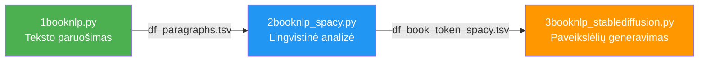

# 🔬 2booknlp_spacy.py — Lingvistinė knygos analizė su spaCy ir WordNet

**Failas:** [2booknlp_spacy.py](file:///c:/Users/jarek/Desktop/uzduotys/uzd3/2booknlp_spacy.py)  
**Originalus Colab:** [BookNLP_spaCy.ipynb](https://colab.research.google.com/drive/1Ib0NVhiJ1McSlAmCoGXJGRCmK9wz3NDQ)  
**Eilučių skaičius:** 422 | **Dydis:** ~28 KB

---

## 🎯 Bendras tikslas (paprastai)

Šis failas yra **antrasis žingsnis** vamzdyne. Jis paima pirmojo sąsiuvinio paruoštą lentelę su knygos pastraipomis ir kiekvieną žodį „perleidžia" per kalbos analizės įrankius. Rezultatas – kiekvienas knygos žodis turi prie savęs prilipdytą informaciją: koks tai kalbos dalis (daiktavardis, veiksmažodis…), ką jis reiškia žodyne, kokiam esiniui (entity) jis priklauso ir pan.

**Analogija:** Pirmas failas „nuskaitė" knygą į lentelę. Šis failas ją „perskaito" kaip lingvistas – prie kiekvieno žodžio parašo gramatines pastabas, pažymi vardus, vietas, datas ir suranda žodžio reikšmę žodyne.

---

## 📋 Kas gaunama rezultate?

| Rezultatas | Aprašymas |
|---|---|
| `df_book_token_spacy` | Lentelė, kur kiekviena eilutė = vienas žodis (tokenas) su ~20 stulpelių anotacijų |
| `df_book_entity_spacy` | Lentelė su visais atpažintais esiniais (vardais, vietovėmis, datomis ir kt.) |
| `df_book_noun_chunk_spacy` | Lentelė su daiktavardinėmis frazėmis (pvz., „the old man", „a dark room") |
| TSV failas Google Drive | Eksportuota tokenų lentelė `.tsv` formatu |

---

## 🔍 Detalus kodo aprašymas dalimis

---

### 1. Importai ir aplinkos paruošimas (31–47 eil.)

```python
Vol = 'Vol2'

from google.colab import files
import pandas as pd
import urllib.request
import os.path
import re
import requests
import json

import nltk
from nltk.corpus import wordnet as wn
nltk.download('wordnet')
from nltk.wsd import lesk
```

**Techniškai:**
- Importuojamos tos pačios bazinės bibliotekos kaip pirmame faile (`pandas`, `re`, `json`).
- **Naujos bibliotekos:**
  - `nltk` (Natural Language Toolkit) – viena seniausių ir plačiausiai naudojamų NLP bibliotekų Python kalba.
  - `wordnet` – didžiulis anglų kalbos žodynas-tezauras, kuriame žodžiai susieti pagal reikšmes, sinonimus, hierarchijas.
  - `lesk` – algoritmas, kuris nustato žodžio reikšmę pagal kontekstą (pvz., „bank" – bankas ar upės krantas?).

**Paprastai:** Programa pasiruošia darbui – be standartinių įrankių, prideda dar du galingus kalbos supratimo įrankius: žodyną (WordNet) ir reikšmės nustatymo algoritmą (Lesk). Tai kaip lingvistui prie stalo padėti žodyną ir enciklopediją.

---

### 2. Google Drive prijungimas (55–61 eil.)

```python
if os.path.isdir('/content/drive/MyDrive'):
    print('Google Drive is mounted.')
else:
    drive.mount('/content/drive')
```

**Paprastai:** Prijungiame Google Drive – ten saugomi duomenys iš pirmojo žingsnio.

---

### 3. Knygos duomenų įkėlimas (70–75 eil.)

```python
book_code = '2852'
book_corp_path = f'/content/drive/MyDrive/Book_Info/{Vol}/'
paragraphs_path = book_corp_path + 'book_text/df_paragraphs_' + book_code + '.tsv'
df_paragraphs = pd.read_csv(paragraphs_path, sep='\t')
```

**Techniškai:** Nuskaitoma TSV lentelė, kurią sukūrė pirmasis sąsiuvinis. `book_code = '2852'` atitinka „The Hound of the Baskervilles". `pd.read_csv` su `sep='\t'` skaito tab-separated formatą.

**Paprastai:** Atidarome lentelę su knygos pastraipomis, kurią paruošė pirmas failas. Tai kaip atidaryti Excel failą, kurį kažkas jau sutvarkė.

---

### 4. NLP variklio inicializacija (84–85 eil.)

```python
import spacy
nlp = spacy.load("en_core_web_sm")
```

**Techniškai:** Įkeliamas spaCy modelis `en_core_web_sm` – mažas, bet veiksmingas anglų kalbos modelis (~12 MB). Jis sugeba:
- **Tokenizuoti** – suskaidyti tekstą į žodžius ir skyrybos ženklus
- **POS žymėjimas** – nustatyti kalbos dalį (daiktavardis, veiksmažodis…)
- **Priklausomybių analizė** – nustatyti, kuris žodis priklauso kuriam (pvz., būdvardis → daiktavardis)
- **Esinių atpažinimas (NER)** – rasti vardus, vietas, datas, organizacijas
- **Daiktavardinės frazės** – grupuoti susijusius žodžius (pvz., „the old wooden door")

**Paprastai:** Įjungiame „dirbtinį lingvistą" – kompiuterinį modelį, kuris moka skaityti anglų kalbą ir suprasti kiekvieno žodžio vaidmenį sakinyje. Tai kaip pasamdyti kalbininką, kuris perskaitys visą knygą ir prie kiekvieno žodžio parašys pastabas.

---

### 5. WordNet pagalbinė funkcija (96–140 eil.)

```python
def wordnet_info(word, word_pos, sentence_str):
```

Ši funkcija kiekvienam žodžiui ieško informacijos WordNet žodyne:

**Techniškai:**

1. **Dažniausia reikšmė (Most Frequent Synset):**
   ```python
   synsets = wn.synsets(word, pos=wn.NOUN)  # arba VERB, ADJ, ADV
   most_frequent_synset = synsets[0]
   most_frequent_synset_key = most_frequent_synset.lemmas()[0].key()
   ```
   Paima pirmą (dažniausiai naudojamą) žodžio reikšmę iš WordNet. Pvz., žodis „dog" → `dog.n.01` (keturkojis gyvūnas).

2. **Kontekstinė reikšmė (Lesk algoritmas):**
   ```python
   lesk_synset = lesk(sentence, word, pos='n')
   ```
   Lesk algoritmas nustato žodžio reikšmę pagal sakinio kontekstą. Pvz., „I went to the **bank** to deposit money" → `bank.n.01` (finansinė institucija), o ne upės krantas.

3. **Hipernyminė hierarchija:**
   ```python
   hypernym_paths = most_frequent_synset.hypernym_paths()
   hypernym_path_key = [synset.lemmas()[0].key() for synset in hypernym_path]
   ```
   Suranda žodžio „protėvių grandinę" reikšmių medyje. Pvz.: `pug → dog → canine → mammal → animal → organism → entity`.

**Paprastai:** Ši funkcija yra kaip „žodyno konsultantas":
- Ji pasako, kokia **dažniausia** žodžio reikšmė
- Ji pasako, kokia reikšmė **šiame sakinyje** (nes vienas žodis gali turėti daug reikšmių)
- Ji pasako žodžio „šeimos medį" – pvz., šuo yra šunų šeimos narys, o šunų šeima – žinduoliai, žinduoliai – gyvūnai ir t.t.

---

### 6. Pagrindinis anotacijos ciklas (151–301 eil.)

Tai **didžiausia ir svarbiausia** failo dalis. Čia vyksta visas tekstas per spaCy ir WordNet.

#### 6a. Sąrašų inicializacija (154–197 eil.)

```python
token_text_list = []
token_lemma_list = []
token_pos_list = []
token_tag_list = []
token_dep_list = []
# ... dar ~20 sąrašų
```

**Techniškai:** Sukuriami tušti Python sąrašai kiekvienam duomenų stulpeliui. Kiekvienas sąrašas rinks vieną atributo reikšmę per visus knygos žodžius. Galiausiai visi sąrašai bus sujungti į vieną DataFrame lentelę.

**Paprastai:** Paruošiama tuščia „lentelė" su daug stulpelių – kiekvienas žodis gaus savo eilutę su visomis pastabomis.

#### 6b. Iteracija per pastraipas ir sakinius (199–301 eil.)

```python
for index, row in df_paragraphs.iterrows():
    paragraph = row["paragraph"]
    doc = nlp(my_text)           # spaCy apdoroja visą pastraipą
    
    for sent_i, sent in enumerate(doc.sents):    # kiekvienas sakinys
        for token in sent:                        # kiekvienas žodis
            # ... renkame informaciją apie žodį
```

**Techniškai – kiekvieno žodžio anotacijos:**

| Atributas | Ką reiškia | Pavyzdys žodžiui „running" |
|---|---|---|
| `token.text` | Originalus žodis | `running` |
| `token.lemma_` | Pamatinė forma (lemma) | `run` |
| `token.pos_` | Kalbos dalis (bendras) | `VERB` |
| `token.tag_` | Kalbos dalis (detalus) | `VBG` (veiksmažodžio gerundijus) |
| `token.dep_` | Priklausomybės ryšys | `ROOT` (sakinio šaknis) |
| `token.is_stop` | Ar tai stop-žodis? | `False` |
| `token.head.text` | Nuo kurio žodžio priklauso | `was` |
| `token.head.pos_` | To žodžio kalbos dalis | `AUX` |
| `token.ent_type_` | Esinio tipas (jei yra) | `""` (arba `PERSON`, `GPE`...) |
| `token.is_quote` | Ar kabutėse? | `0` arba `1` |
| `wn_mf_synset` | WordNet dažniausia reikšmė | `run%2:38:04::` |
| `wn_lesk_synset` | WordNet kontekstinė reikšmė | `run%2:33:00::` |

**Kabutės / citatos sekimas:**
```python
if token.is_quote:
    is_quote = 1 - is_quote  # „perjungiklis": 0→1 arba 1→0
is_quote_list.append(is_quote)
```
Tai sekimas, ar žodis yra kabutėse (dialogas). Kiekvienas kabutės ženklas „perjungia" būseną.

**Noun chunk (daiktavardinė frazė) priklausomybė:**
```python
for chunk in doc.noun_chunks:
    if token in chunk:
        token_in_chunk = 1
        break
```
Tikrina, ar žodis priklauso kokiai nors daiktavardinei frazei.

**Esinių rinkimas (270–277 eil.):**
```python
for entity in sent.ents:
    entity_text_list.append(entity.text)       # pvz., "Sherlock Holmes"
    entity_label_list.append(entity.label_)     # pvz., "PERSON"
```

**Daiktavardinių frazių rinkimas (279–299 eil.):**
```python
for chunk in sent.noun_chunks:
    noun_chunk_text_list.append(chunk.text)           # pvz., "the old wooden door"
    noun_chunk_root_text_list.append(chunk.root.text)  # pvz., "door"
```

**Paprastai:** Programa eina per kiekvieną knygos žodį ir daro štai ką:
1. Nustato, kokia tai kalbos dalis (daiktavardis? veiksmažodis?)
2. Suranda pamatinę formą (pvz., „bėgo" → „bėgti")
3. Nustato ryšius su kitais žodžiais (pvz., „didelis" priklauso „namas")
4. Atpažįsta vardus, vietas, datas (pvz., „Šerlokas Holmsas" = asmuo)
5. Ieško žodžio reikšmės žodyne
6. Pažymi, ar žodis yra dialoge (kabutėse)
7. Grupuoja susijusius žodžius į frazes (pvz., „senas medinis namas")

---

### 7. DataFrame lentelių kūrimas (310–316 eil.)

```python
df_book_token_spacy = pd.DataFrame({
    'token': token_text_list, 
    'lemma': token_lemma_list, 
    'pos': token_pos_list,
    # ... visi kiti stulpeliai
})

df_book_entity_spacy = pd.DataFrame({...})
df_book_noun_chunk_spacy = pd.DataFrame({...})
```

**Techniškai:** Visi surinkti sąrašai sujungiami į tris pandas DataFrame lenteles. Tai transformuoja daugybę atskirų sąrašų į vieną struktūruotą lentelę.

**Paprastai:** Visas pastabas, kurias „lingvistas" parašė prie kiekvieno žodžio, sudedame į tvarkingą lentelę, kur galima lengvai ieškoti ir filtruoti.

---

### 8. Rezultatų išsaugojimas (331–342 eil.)

```python
token_spacy_path = book_corp_path + 'tmp/df_book_token_spacy_' + book_code + '.tsv'
df_book_token_spacy.to_csv(token_spacy_path, sep='\t', index=False)
```

**Techniškai:** Tokenų lentelė eksportuojama kaip TSV failas į `tmp` aplanką Google Drive. Kiti anotacijų failai (esiniai, noun chunks) šiuo metu neeksportuojami (zakomentaruoti).

**Paprastai:** Išsaugome rezultatus – kiekvienas knygos žodis su visomis savo „pastabyomis" saugomas kaip lentelė, kurią galima atidaryti ir toliau analizuoti.

---

### 9. Interaktyvi vizualizacija su PyGWalker (360–393 eil.)

```python
#!pip install pygwalker -q
#import pygwalker as pyg
#pyg.walk(df_book_token_spacy, spec=vis_spec)
```

**Techniškai:** Šioje dalyje saugomos PyGWalker vizualizacijos konfigūracijos (JSON spec) trims lentelėms. PyGWalker – tai Tableau-panašus interaktyvus duomenų tyrinėjimo įrankis Jupyter/Colab aplinkoje. Visos eilutės užkomentuotos ir nenaudojamos pagal nutylėjimą.

Saugomos trys vizualizacijos specifikacijos:
- **Tokenų lentelė** – stulpelinė diagrama: žodžių skaičius pagal skyrius, spalvinta pagal `is_quote`
- **Esinių lentelė** – esinių skaičius pagal pavadinimą ir tipą (PERSON, GPE ir kt.)
- **Noun chunk lentelė** – dažniausios daiktavardinės frazės pagal šaknį

**Paprastai:** Tai paruoštos „diagramų receiptai" – jei norite vizualiai pažiūrėti į duomenis (pvz., kiek žodžių kiekviename skyriuje, kokie vardai dažniausi), galite atkomentuoti šias eilutes ir gauti interaktyvias diagramas.

---

### 10. Gutenberg katalogo atsisiuntimas (401–410 eil.)

```python
get_catalog = False

if get_catalog:
    df_books_catalog = pd.read_csv(
        'https://www.gutenberg.org/cache/epub/feeds/pg_catalog.csv',
        keep_default_na=False
    )
    df_books_catalog = df_books_catalog[df_books_catalog['Language']=='en']
```

**Techniškai:** Pasirinktinė funkcija, kuri atsisiunčia visą Project Gutenberg knygų katalogą (~70 000+ knygų) ir filtruoja tik angliškas. Išjungta pagal nutylėjimą.

**Paprastai:** Jei norite pamatyti, kokios knygos yra prieinamos nemokamam skaitymui Gutenberg projekte – galite įjungti šią dalį ir gauti pilną sąrašą.

---

## 📊 Rezultato pavyzdys

Kiekvienas knygos žodis gauna eilutę tokių lentelėje (`df_book_token_spacy`):

| token | lemma | pos | tag | dep | is_stop | head | ent_type | is_quote | wn_mf_synset |
|---|---|---|---|---|---|---|---|---|---|
| Sherlock | Sherlock | PROPN | NNP | compound | False | Holmes | PERSON | 0 | |
| Holmes | Holmes | PROPN | NNP | nsubj | False | sat | PERSON | 0 | |
| sat | sit | VERB | VBD | ROOT | False | sat | | 0 | sit%2:35:00:: |
| in | in | ADP | IN | prep | True | sat | | 0 | |
| the | the | DET | DT | det | True | chair | | 0 | |
| old | old | ADJ | JJ | amod | False | chair | | 0 | old%3:00:01:: |
| chair | chair | NOUN | NN | pobj | False | in | | 0 | chair%1:06:00:: |

---

## 🔗 Ryšys su kitais failais



---

## 📚 Naudojamos technologijos

| Technologija | Paskirtis |
|---|---|
| **spaCy** (`en_core_web_sm`) | Tokenizacija, POS žymėjimas, priklausomybių analizė, NER, noun chunks |
| **NLTK WordNet** | Žodžio reikšmių ieškojimas, sinonimų/hiperonymų hierarchijos |
| **NLTK Lesk** | Kontekstinė žodžio reikšmės disambiguacija (žodis „bank" – kuris „bank"?) |
| **pandas** | Duomenų lentelių kūrimas ir eksportavimas |
| **PyGWalker** (pasirinktinis) | Interaktyvi vizualizacija Colab aplinkoje |
| **Google Drive** | Duomenų saugojimas ir pasidalinimas tarp sąsiuvinių |

---

## 🧠 Svarbūs principai

1. **Tokenizacija** – tekstas suskaidomas į mažiausius vienetus (žodžius, skyrybos ženklus). Tarpai nėra tokenai ir yra praleidžiami.

2. **POS žymėjimas** – kiekvienas žodis gauna etiketę: `NOUN` (daiktavardis), `VERB` (veiksmažodis), `ADJ` (būdvardis), `DET` (artikelis), `ADP` (prielinksnis) ir kt.

3. **Priklausomybių medis** – kiekvienas žodis „priklauso" kitam žodžiui. Pvz., sakinyje „The big dog ran fast" – `big` priklauso `dog` (būdvardis modifikuoja daiktavardį), o `dog` priklauso `ran` (veikėjas priklauso veiksmui).

4. **NER (Named Entity Recognition)** – atpažįstami tikrinami daiktavardžiai: `PERSON` (žmogaus vardas), `GPE` (šalis/miestas), `DATE` (data), `ORG` (organizacija) ir kt.

5. **WordNet hierarchija** – leidžia suprasti, kad „šuo" ir „katė" abi yra „gyvūnai", o „kėdė" ir „stalas" – „baldai". Tai būtina semantinei analizei.

6. **Lesk algoritmas** – sprendžia žodžių daugiareikšmiškumo problemą. Pvz., „He sat on the **bank** of the river" → `bank` = krantas, ne bankas.
