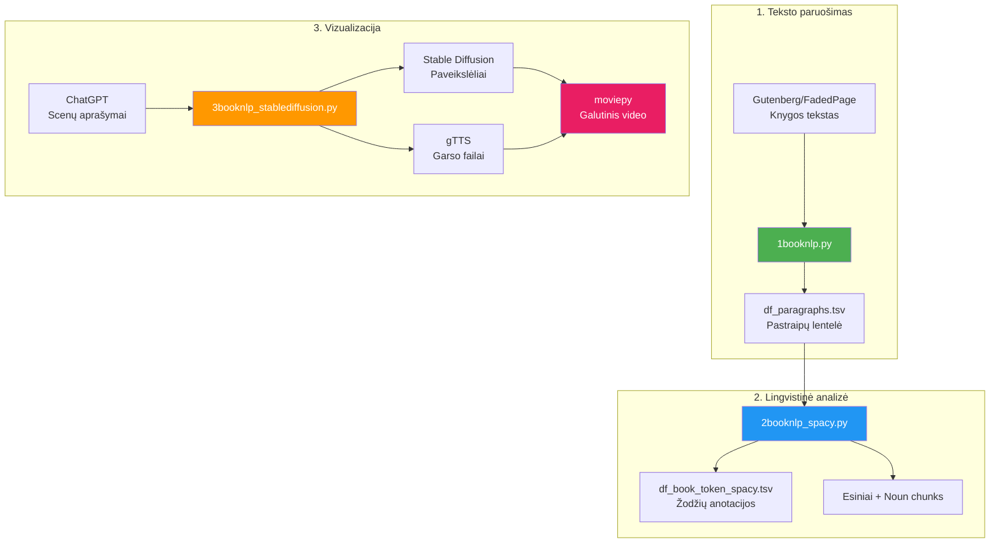

# 🎨 3booknlp_stablediffusion.py — Teksto vertimas į paveikslėlius ir vaizdo įrašą

**Failas:** [3booknlp_stablediffusion.py](file:///c:/Users/jarek/Desktop/uzduotys/uzd3/3booknlp_stablediffusion.py)  
**Originalus Colab:** [BookNLP_StableDiffusion.ipynb](https://colab.research.google.com/drive/1WhU5TzT_r84mf1feaYmsczQD-lcdqDws)  
**Eilučių skaičius:** 579 | **Dydis:** ~17.5 KB

---

## 🎯 Bendras tikslas (paprastai)

Šis failas yra **trečiasis ir paskutinis žingsnis** vamzdyne. Jo užduotis – paversti knygos arba filmo scenas **paveikslėliais** naudojant dirbtinį intelektą (Stable Diffusion), pridėti **garsą** (teksto-į-kalbą) ir viską sujungti į **vaizdo įrašą**.

**Analogija:** Pirmasis failas paruošė knygos tekstą, antrasis jį lingvistiškai išanalizavo, o šis – „nupiešia" scenas ir sukuria iš jų filmą su pasakojimo garsu. Tai kaip animatorius, kuris perskaito scenarijų ir sukuria animacinę juostą.

---

## 📋 Kas gaunama rezultate?

| Rezultatas | Aprašymas |
|---|---|
| Atskiri paveikslėliai | Kiekvienai scenai sugeneruotas paveikslėlis (JPEG) |
| `saved_images.zip` | Visų paveikslėlių archyvas |
| `output_video_with_audio.mp4` | Galutinis vaizdo įrašas su garsu |
| MP3 failai | Kiekvienai scenai – garso komentaras |

---

## 🔍 Detalus kodo aprašymas dalimis

---

### 1. Importai ir stilių sąrašas (18–44 eil.)

```python
from google.colab import files
import pandas as pd
import os.path
import re
import numpy as np
import cv2
import os
import requests
import json

style_list = [
    "Colorful cartoon drawing style", 
    "anime art style", 
    "Line drawing",
    "Salvador Dali",
    "Vincent van Gogh",
    # ... dar ~50 stilių
]
```

**Techniškai:**
- Importuojamos bibliotekos: `numpy` (skaičiavimai su masyvais), `cv2` (OpenCV – paveikslėlių apdorojimas), `requests` (HTTP), `json`.
- `style_list` – tai **50+ dailės stilių sąrašas**, kurį galima naudoti paveikslėlių generavimui. Stiliai apima:
  - Piešimo technikas: karikatūra, anime, linijinis piešimas, pikselių menas
  - Meno kryptis: impresionizmas, siurrealizmas, kubizmas, pop'artas, baroko
  - Fotografijos stilius: makro, povandeninė, naktinė
  - Garsių dailininkų stiliai: Van Gogh, Klimt, Escher, Monet, Picasso, Da Vinci, Warhol, Dalí
  - Šiuolaikiniai digitaliniai stiliai: kyberpankas, steampunkas, fantasy, sci-fi

**Paprastai:** Programa pasiruošia darbui ir turi didelę kolekciją „piešimo stilių" – galite pasirinkti, ar norite paveikslėlių Van Gogho, anime, karikatūros ar bet kuriuo kitu stiliumi.

---

### 2. Google Drive prijungimas (55–61 eil.)

```python
if os.path.isdir('/content/drive/MyDrive'):
    print('Google Drive is mounted.')
else:
    drive.mount('/content/drive')
```

**Paprastai:** Prijungiame Google Drive – kaip ir ankstesniuose failuose.

---

### 3. Stiliaus ir neigiamo prompt pasirinkimas (68–69 eil.)

```python
style = style_list[0]  # "Colorful cartoon drawing style"
negative_prompt = 'distorted, ugly, deformed, disfigured, poor details'
```

**Techniškai:** 
- `style` – pasirinktas dailės stilius iš sąrašo (čia: spalvinga karikatūra). Keičiant indeksą galima pasirinkti bet kurį kitą stilių.
- `negative_prompt` – tai „anti-instrukcija" Stable Diffusion modeliui: ko **NEREIKIA** piešti. Tai padeda išvengti netaisyklingų, iškraipytų ar žemos kokybės paveikslėlių.

**Paprastai:** Pasirenkame piešimo stilių (spalvinga karikatūra) ir pasakome AI: „piešk gražiai, nepieš bjauriai ir iškraipytai".

---

### 4. Scenų aprašymų gavimas iš ChatGPT (71–203 eil.)

Tai viena didžiausių ir svarbiausių dalių – scenos paruošimas.

#### 4a. ChatGPT prompt šablonas (71–131 eil.)

Komentaruose aprašytas detalus prompt, kurį reikia pateikti ChatGPT:

```
You are a screenwriter and director who must provide the content 
of a work of art in the form of a list of scenes that describe 
the structural information in JSON format. The work you are to 
illustrate is 'The Matrix'. Create a description of 10 scenes...
```

**Techniškai:** Tai ChatGPT instrukcija, kuri prašo:
- Sukurti N scenų aprašymus iš nurodyto kūrinio
- Kiekvienai scenai pateikti JSON struktūrą su laukais:
  - `scene_title` – scenos pavadinimas
  - `dialog_summary` – dialogo santrauka
  - `description` – vizualinis scenos aprašymas
  - `scene_environment` – aplinkos aprašymas be veikėjų
  - `scene_type` – INT (viduje) arba EXT (lauke)
  - `scene_date` – metai
  - `location` – vieta
  - `time_of_day` – paros metas
  - `characters` – veikėjų sąrašas
  - `objects` – daiktų sąrašas
  - `motion_sequence` – judesio veiksmažodžiai
  - `constant_state_sequence` – statinio būvio veiksmažodžiai

**Paprastai:** Prašome ChatGPT perskaityti knygą/filmą ir aprašyti 10 svarbiausių scenų struktūruota forma – kas vyksta, kur vyksta, kas dalyvauja, kokie daiktai matomi. Tai kaip kino režisierius rašo filmavimo planą.

#### 4b. Pavyzdinis JSON atsakymas (133–170 eil.)

```python
prompt_response_json_text = """
[
    {
        "scene_title": "The Hacker's Lair",
        "dialog_summary": "Neo receives a mysterious message...",
        "description": "A dark, cramped room cluttered with computers...",
        "scene_environment": "Dim room filled with humming servers...",
        "scene_type": "INT",
        "scene_date": "1999",
        "location": "Abandoned Building",
        "time_of_day": "NIGHT",
        "characters": ["Neo", "Morpheus"],
        "objects": ["computer", "monitor", "keyboard", "cables"],
        "motion_sequence": ["typing", "scrolling"],
        "constant_state_sequence": ["glowing", "idle"]
    }
]
"""
```

**Paprastai:** Čia yra pavyzdys – viena scena iš „Matrix" filmo: tamsi patalpa su kompiuteriais, Neo gauna paslaptingą žinutę. Visa tai užrašyta struktūruota forma, kurią programa gali perskaityti.

#### 4c. JSON apdorojimas ir prompt'ų rinkimas (172–203 eil.)

```python
if len(prompt_response_json_text) == 0:
    # Atsisiųsti JSON iš GitHub
    url = "https://raw.githubusercontent.com/.../gpt4_scene_info_" + book_code + ".json"
    response = requests.get(url)
    prompt_response_json_text = response.text
else:
    prompt_response_json_text = '{"1":' + prompt_response_json_text + '}'

data = json.loads(prompt_response_json_text)

prompts = []
scene_dates = []
scene_locations = []
scene_objects = []
for key, value in data.items():
    for item in value:
        prompts.append(item.get('description'))
        scene_dates.append(item.get('scene_date'))
        scene_locations.append(item.get('location'))
        scene_objects.append(item.get('objects'))
```

**Techniškai:** 
- Jei `prompt_response_json_text` tuščias – atsisiunčiamas paruoštas JSON iš GitHub.
- Jei ne – naudojamas čia įrašytas tekstas.
- JSON paverčiamas Python žodynu ir iš jo surenkamos scenų aprašymo dalys: vizualinis aprašymas (`description`), data, vieta, objektai.
- Šie surinkti duomenys naudojami kaip instrukcijos paveikslėlių generavimo modeliui.

**Paprastai:** Programa nuskaito scenas ir paruošia „piešimo užduotis" – kiekvienai scenai sukuriama instrukcija, kas turi būti nupiešta.

---

### 5. Stable Diffusion paveikslėlių generavimas (208–273 eil.)

#### 5a. Modelio įkėlimas (210–234 eil., užkomentuota)

```python
# base_model_id = "stabilityai/stable-diffusion-xl-base-1.0"
# repo_name = "ByteDance/Hyper-SD"
# pipe = DiffusionPipeline.from_pretrained(base_model_id, ...)
# pipe.load_lora_weights(...)
# pipe.scheduler = TCDScheduler.from_config(pipe.scheduler.config)
```

**Techniškai:** Naudojamas **Stable Diffusion XL** modelis su **Hyper-SD** LoRA svoriais iš ByteDance. Tai leidžia sugeneruoti aukštos kokybės paveikslėlius per mažiau žingsnių (8 arba 12 vietoj įprastų 50). `TCDScheduler` – specialus planavimo algoritmas greičiau generuoti.

**Paprastai:** Įjungiamas galingas AI piešėjas, kuris moka piešti bet ką pagal tekstinį aprašymą. Naudojama papildoma „turbo" versija, kuri piešia greičiau nei standartinė.

#### 5b. Paveikslėlių generavimo ciklas (236–253 eil.)

```python
seed = random.randint(0, sys.maxsize)
guidance_scale = 5.0
eta = 0.1

all_images_list = []
for image_nr, prompt in enumerate(prompts):
    # Sukonstruojamas pilnas prompt su data, vieta, objektais ir stiliumi
    prompt = scene_dates[image_nr] + ". Location is " + scene_locations[image_nr] + \
             ". Objects: " + (", ".join(scene_objects[image_nr])) + \
             ". " + style + ". " + prompt
    
    images = pipe(
        prompt=prompt,
        num_inference_steps=num_inference_steps,
        guidance_scale=guidance_scale,
        eta=eta,
        generator=torch.Generator(device).manual_seed(seed),
        negative_prompt=negative_prompt
    ).images
    
    all_images_list.append((image_nr, prompt, images[0]))
```

**Techniškai:**
- `seed` – atsitiktinis skaičius reprodukuojamumui (tas pats seed = tas pats paveikslėlis)
- `guidance_scale = 5.0` – kaip stipriai modelis seka prompt'ą (5–8 rekomenduojama; didesnis = tiksliau seka, bet mažiau kūrybingas)
- `eta = 0.1` – detalumo parametras (mažesnis = daugiau detalių)
- Kiekvienai scenai sukuriamas **pilnas prompt**, kuris apjungia: datą, vietą, objektus, stilių ir aprašymą
- `pipe(...)` – vykdo paveikslėlio generavimą GPU kortelėje

**Paprastai:** Programa eina per kiekvieną sceną ir „paprašo" AI nupiešti paveikslėlį. Kiekvienam paveikslėliui pasakoma: „1999 metais, apleistame pastate, yra kompiuteriai ir kabeliai, piešk spalvingos karikatūros stiliumi". AI nupiešia ir programa paveikslėlį išsaugo.

#### 5c. Paveikslėlių išsaugojimas (255–273 eil.)

```python
image_list = [np.array(img[2]) for img in all_images_list]

def save_images(image_list, directory):
    if not os.path.exists(directory):
        os.makedirs(directory)
    for i, image in enumerate(image_list):
        filename = f"image_{i}.jpg"
        filepath = os.path.join(directory, filename)
        cv2.imwrite(filepath, image)

save_images(image_list, "saved_images")

# Suarchyvuojama ir kopijuojama į Drive
!zip -r saved_images.zip saved_images
!cp saved_images.zip /content/drive/MyDrive/saved_images.zip
```

**Techniškai:** Paveikslėliai konvertuojami į NumPy masyvus, kiekvienas išsaugomas kaip JPEG failas. Tada visi suarchyvuojami į ZIP ir kopijuojami į Google Drive.

**Paprastai:** Visi nupiešti paveikslėliai sudedami į aplanką, supakuojami ir išsaugomi jūsų Google Drive.

---

### 6. Garso generavimas su gTTS (280–316 eil.)

```python
!pip install gTTS -q

from gtts import gTTS

mp3_list = []
for image_nr, prompt in enumerate(prompts):
    mytext = prompt
    myobj = gTTS(text=mytext, lang='en', slow=False, tld='co.uk')
    myobj.save("welcome" + str(image_nr) + ".mp3")
    mp3_list.append("welcome" + str(image_nr) + ".mp3")
```

**Techniškai:** 
- `gTTS` (Google Text-to-Speech) – nemokama teksto-į-kalbą biblioteka, naudojanti Google Translate balsą.
- `lang='en'` – anglų kalba
- `tld='co.uk'` – naudojamas britiškas anglų kalbos akcentas (vietoj amerikiečių)
- `slow=False` – normali kalbos greitis
- Kiekvienai scenai sukuriamas atskiras MP3 failas su scenos aprašymo garsu.

**Paprastai:** Programa paverčia kiekvienos scenos aprašymą į garsą (kaip audioknygą). Naudojamas britiškas akcentas. Kiekvienai scenai – atskiras garso failas.

---

### 7. Vaizdo įrašo kūrimas su moviepy (318–341 eil.)

```python
!pip install -q moviepy pillow

import numpy as np
from PIL import Image
from moviepy.editor import ImageSequenceClip, AudioFileClip, concatenate_videoclips

frames = [np.array(img) for img in image_list]

video_clips = []
for i, frame in enumerate(frames):
    audio_clip = AudioFileClip(mp3_list[i])
    img_clip = ImageSequenceClip([frame], durations=[audio_clip.duration])
    img_clip = img_clip.set_audio(audio_clip)
    video_clips.append(img_clip)

final_clip = concatenate_videoclips(video_clips)
final_clip.write_videofile("output_video_with_audio.mp4", codec="libx264", fps=1)
```

**Techniškai:**
- `moviepy` – Python biblioteka vaizdo įrašų kūrimui ir redagavimui.
- Kiekvienam kadrui:
  1. Paveikslėlis paverčiamas vieno kadro klipu
  2. Klipo trukmė nustatoma pagal atitinkamo garso failo trukmę (kad paveikslėlis būtų rodomas, kol baigiasi pasakojimas)
  3. Garsas pridedamas prie klipo
- Visi klipai sujungiami į vieną vaizdo įrašą
- Eksportuojama kaip MP4 su H.264 kodeku, 1 kadras per sekundę

**Paprastai:** Programa paima visus paveikslėlius ir garso failus ir „suklijuoja" juos į vaizdo įrašą (filmą). Kiekvienas paveikslėlis rodomas ekrane tol, kol balsas baigia pasakoti scenos aprašymą. Galutinis rezultatas – MP4 vaizdo failas, kurį galite žiūrėti.

---

### 8. Senas (nebenaudojamas) kodas (348–579 eil.)

Ši dalis pažymėta kaip **⛔ Old Code** ir visa yra užkomentuota arba įdėta į `''' '''` blokus.

#### 8a. Sena Keras/TensorFlow Stable Diffusion versija (350–409 eil.)

```python
# Senoji Stable Diffusion implementacija per keras_cv
# model = keras_cv.models.StableDiffusion(img_width=512, img_height=512)
# images = model.text_to_image("...", batch_size=3)
```

**Paprastai:** Tai senesnė paveikslėlių generavimo versija, kuri naudojo kitą biblioteką (Keras). Dabar pakeista naujesnė ir greitesnė HuggingFace Diffusers versija.

#### 8b. Automatinis prompt generavimas iš knygos žodžių (416–488 eil.)

```python
# Šioje dalyje programa:
# 1. Įskaito tokenų lentelę iš 2-ojo sąsiuvinio
# 2. Filtruoja tik daiktavardžius, kurie yra fiziniai objektai (noun.artifact) arba asmenys (PERSON)
# 3. Sudaro prompt'us iš šių žodžių frazių
# 4. Kiekvienas prompt > 100 simbolių tampa atskira "scena" paveikslėliui
```

**Techniškai:** Tai alternatyvus metodas scenų kūrimui – vietoj ChatGPT, programa pati automatiškai kuria piešimo instrukcijas iš lingvistinės analizės rezultatų. Ji naudoja WordNet kategorijas (pvz., `noun.artifact` = fiziniai daiktai) ir NER etiketes (`PERSON`) ir grupuoja juos į frazes.

**Paprastai:** Tai bandymas automatiškai paversti knygos žodžius į piešimo instrukcijas – programa ieško visų fizinių daiktų ir asmenų vardų tekste ir iš jų sudaro scenas. Šiuo metu šis metodas nebenaudojamas – pakeistas ChatGPT variantu.

#### 8c. Senas vaizdo įrašo kūrimo būdas su OpenCV (522–559 eil.)

```python
# video = cv2.VideoWriter(video_name, fourcc, 1, image_shape)
# for image_tuple in all_images_list:
#     video.write(image)
# video.release()
```

**Paprastai:** Senesnės versijos vaizdo įrašo kūrimas su OpenCV (be garso). Dabar pakeistas moviepy variantu, kuris palaiko garsą.

#### 8d. Senas moviepy be garso (563–579 eil.)

```python
# clip = ImageSequenceClip(frames, fps=fps)
# clip.write_videofile("output_video.mp4", codec="libx264")
```

**Paprastai:** Dar viena senesnė vaizdo įrašo versija – su moviepy, bet be garso.

---

## 🔗 Pilno vamzdyno schema



---

## 📚 Naudojamos technologijos

| Technologija | Paskirtis |
|---|---|
| **Stable Diffusion XL** | AI paveikslėlių generavimas iš teksto |
| **Hyper-SD (ByteDance)** | Pagreičio LoRA svoriai – greičiau piešia |
| **HuggingFace Diffusers** | Stable Diffusion modelio biblioteka Python |
| **gTTS** | Google Text-to-Speech garso generavimas |
| **moviepy** | Vaizdo įrašų kūrimas ir montavimas |
| **OpenCV (cv2)** | Paveikslėlių saugojimas ir apdorojimas |
| **NumPy** | Paveikslėlių duomenų masyvai |
| **PIL/Pillow** | Paveikslėlių konvertavimas |
| **ChatGPT / Gemini** | Scenų aprašymų generavimas (išorinis žingsnis) |

---

## 🧠 Svarbūs principai

1. **Stable Diffusion** – tai atviro kodo AI modelis, kuris sugeba sugeneruoti fotorealistinius ar meniškus paveikslėlius iš tekstinio aprašymo. Jis „moko" iš milijonų paveikslėlių su aprašymais ir vėliau gali kurti naujus.

2. **LoRA (Low-Rank Adaptation)** – tai technika, leidžianti „priderinti" didelį modelį be viso jo permokymo. Hyper-SD LoRA svoriai pagreitina generavimą iš 50 iki 8–12 žingsnių.

3. **Negative prompt** – tai būdas pasakyti modeliui, ko vengti. Be jo, modelis kartais sukuria iškraipytus veidus ar nenatūralius objektus.

4. **Guidance scale** – parametras, kuris kontroliuoja, kaip tiksliai modelis seka instrukcijas. Per mažas (< 3) = chaotiškas; per didelis (> 15) = per tiesmukas ir nenatūralus; 5–8 = optimalus.

5. **Tekst-į-kalbą (TTS)** – gTTS naudoja Google Translate technologiją. Britiškas akcentas pasirenkamas per `tld='co.uk'` parametrą.

6. **Vaizdo trukmė pagal garsą** – kiekvieno kadro trukmė nustatoma pagal garso failo trukmę, todėl vaizdo įrašas rodo paveikslėlį tol, kol baigiasi pasakojimas. Tai kur kas natūraliau nei fiksuotas laikas.

---

## ⚡ Aktyvios vs. neaktyvios dalys

| Dalis | Būsena | Aprašymas |
|---|---|---|
| Scenų JSON iš ChatGPT | ✅ Aktyvus | Naudoja vartotojo pateiktus scenų aprašymus |
| Stable Diffusion XL + Hyper-SD | ✅ Aktyvus | Generuoja paveikslėlius (reikia GPU) |
| gTTS garso generavimas | ✅ Aktyvus | Sukuria MP3 kiekvienai scenai |
| moviepy vaizdo montavimas | ✅ Aktyvus | Sukuria galutinį MP4 su garsu |
| Keras/TensorFlow SD | ❌ Neaktyvus | Sena versija, pakeista HuggingFace |
| Automatiniai prompt'ai iš knygos | ❌ Neaktyvus | Sena versija, pakeista ChatGPT |
| OpenCV video be garso | ❌ Neaktyvus | Sena versija, pakeista moviepy |
